# VQ-VAE HipMRI Image Reconstruction

## Project Description
Author: Declan Bolster (46992877)

This repository implemented a Vector-Quantised Variational AutoEncoder (VQ-VAE) to test the image reconstruction capabilities of the neural structure with the processed 2D slices of the HipMRI Study on Prostate Cancer as the data set. 

This repository focused specifically on the reconstruction capabilities of the VQ-VAE, not image generation or segmentation. The primary objective of this repository was to train the VQ-VAE to reconstruct the unseen test image subset of the data set with a Structural Similarity Measure (SSIM) of at least 0.6.

For further information regarding the study the data set originated from:
https://doi.org/10.25919/45t8-p065

The paper that initially proposed the VQ-VAE:
https://arxiv.org/abs/1711.00937

- [VQ-VAE HipMRI Image Reconstruction](#vq-vae-hipmri-image-reconstruction)
  - [Project Description](#project-description)
  - [Why VQ-VAE?](#why-vq-vae)
  - [Project Outline](#project-outline)
  - [Model Architecture - modules.py](#model-architecture---modulespy)
    - [Encoder](#encoder)
    - [VectorQuantiser and CodeBook](#vectorquantiser-and-codebook)
    - [Decoder](#decoder)
  - [Data-preprocessing](#data-preprocessing)
- [Development Process - Training](#development-process---training)
  - [First Attempt (Medium SSIM, Runaway Loss)](#first-attempt-medium-ssim-runaway-loss)
  - [Second Attempt (Complete Model Collapse)](#second-attempt-complete-model-collapse)
  - [Third Attempt (Functioning model meeting expectations, but with 0-1 loss fluctuation)](#third-attempt-functioning-model-meeting-expectations-but-with-0-1-loss-fluctuation)
    - [Training \& Validation](#training--validation)
    - [Testing](#testing)
  - [Fourth Attempt (Fine-tuning parameters)](#fourth-attempt-fine-tuning-parameters)
    - [Training and Validation](#training-and-validation)
    - [Testing](#testing-1)
  - [Dependencies](#dependencies)
  - [Improvements and shortcomings](#improvements-and-shortcomings)
  - [Replication](#replication)
  - [References](#references)

## Why VQ-VAE?
The VQ-VAE solves the limitations of the traditional VAE, which has a continuous latent space. 

These problems include a generally blurry reconstruction of images:
The latent space being continuous causes the Decoder to often produced averaged outputs when multiple possible reconstructions exists for a particular feature of an image i.e. blurring a combination of possible digits.

The measure of loss in a traditional VAE places particular emphasis on how far the encoder's latent distribution q(z|x)  is from the prior distribution of the latent space p(z), the KL term. 

$$L = \underbrace{\mathbb{E}_{q(z|x)}[-\log p(x|z)]}_{\text{reconstruction loss}} + \underbrace{KL(q(z|x) \| p(z))}_{\text{KL divergence}}$$

**Where:**
- $L$ — total loss (objective function for the VAE)  
- $x$ — input data  
- $z$ — latent variable (encoded representation of $x$)  
- $q(z \mid x)$ — encoder’s approximate posterior distribution  
- $p(x \mid z)$ — decoder’s likelihood of reconstructing $x$ from $z$  
- $p(z)$ — prior distribution over latent variables (usually standard normal $\mathcal{N}(0, I)$)  
- $\mathbb{E}_{q(z \mid x)}[-\log p(x \mid z)]$ — reconstruction loss (how well the decoder reconstructs the input)  
- $KL(q(z \mid x) \| p(z))$ — Kullback–Leibler divergence (regularizes the latent space)

This regulates the latent variables to not vary too widely between a single back-propagation. This can unfortunately also cause KL to dominate the measured loss - causing the Encoder to collapse its outputs towards the prior latent space p(z).

## Project Outline
- dataset.py
  - This is where the methods used to process the nifti files are present
- modules.py
  - This is where the VQ-VAE model is written
- train.py 
  - This script is the first of two scripts run, of which trains the VQ-VAE against a train set and validates the training via the validate set. Then tests it against the test set
- predict.py
  - This is the second of two files run - returning the reconstructions generated on the test data.

## Model Architecture - modules.py

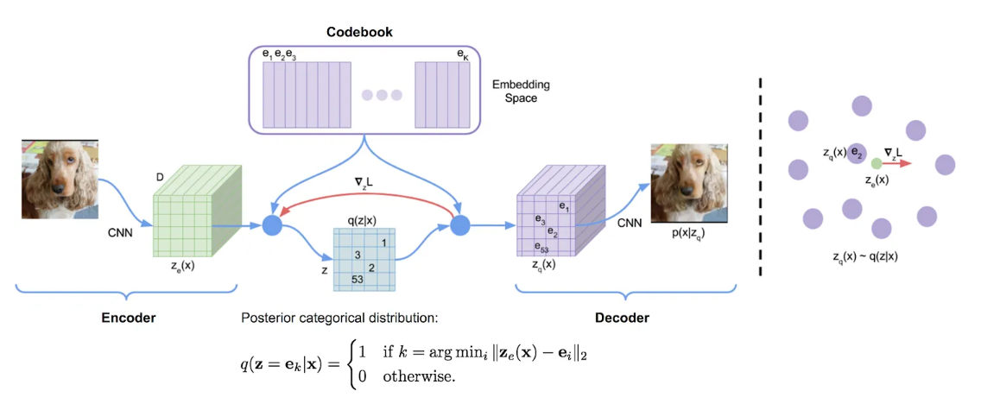

### Encoder
The Encoder functions as a convolutional neural (CNN) network that downsamples an image into a feature map of vectors. Since an Encoder downsamples to a latent space, having this latent space be a vector codebook causes said space to be "quantised".

Residual Block:
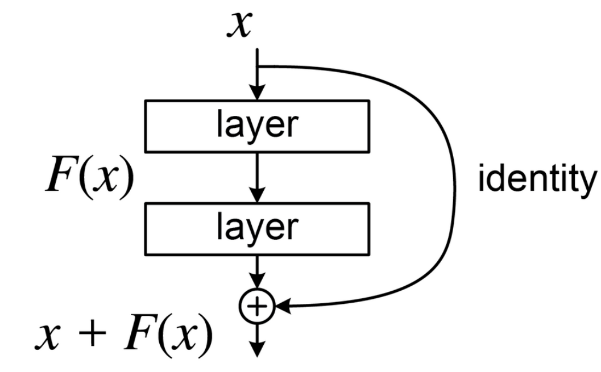

  This is an optional addition to an encoder that prevents information being "lost" between layers of downsampling within the the Encoder and adding depth to the network. This functions much like a conventional block that applies convolution, normalisation, and non-linear activation, but then adds the input of the block to the output, skipping all these layers - a skip connection. This prevents the mentioned loss of minor features between layers.

### VectorQuantiser and CodeBook
This converts the continuous representation that the Encoder returns into a discrete representation of the latent space. This discrete latent space is the CodeBook - a trainable dictionary that is iterated through after the downsampling of the Encoder to find which of the vectors it is instantiated with is most similar to the Encoder's output. This is achieved by comparing the Euclidean distances of each of these vectors:

$$ k^* = \arg\min_k \| z_e(x) - e_k \|^2 $$

**Where:**
- $k^*$ — index of the nearest embedding vector (the chosen code)  
- $k$ — index iterating over all possible codebook embeddings  
- $z_e(x)$ — encoder output (continuous latent vector for input $x$)  
- $e_k$ — embedding vector (code) from the codebook  
- $\| z_e(x) - e_k \|^2$ — squared Euclidean distance between encoder output and a codebook vector  
- $\arg\min_k$ — operation that selects the index $k$ giving the minimum distance

This new vector becomes the input to the Decoder, as opposed to the output of the Encoder. During backpropagation, where the image reconstruction is compared to the original image (after the Decoder output), loss is calculated as so:

see here

$$
L = \|x - \hat{x}\|^2_{\text{(reconstruction loss)}} \\
+ \| \mathrm{sg}\!\left[z_e(x)\right] - e_{k^*} \|^2_{\text{(codebook loss)}} \\
+ \beta \, \| z_e(x) - \mathrm{sg}\!\left[e_{k^*}\right] \|^2_{\text{(commitment loss)}}
$$

**Where:**
- $L$ — total loss for the VQ-VAE  
- $x$ — original input data  
- $\hat{x}$ — reconstructed output from the decoder  
- $z_e(x)$ — encoder output (continuous latent vector)  
- $e_{k^*}$ — selected embedding vector from the codebook (quantized representation)  
- $\text{sg}[\cdot]$ — stop-gradient operator (gradient is not propagated through this term)  
- $\beta$ — weighting coefficient controlling the strength of the commitment loss  
- $\|x - \hat{x}\|^2$ — **reconstruction loss**, measures how well the reconstruction matches the input  
- $\|\text{sg}[z_e(x)] - e_{k^*}\|^2$ — **codebook loss**, moves codebook embeddings toward encoder outputs  
- $\beta \|z_e(x) - \text{sg}[e_{k^*}]\|^2$ — **commitment loss**, encourages encoder outputs to commit to a single codebook vector

The gradients of the Encoder and Decoder are updated, and the codebook receives gradients from the codebook loss term, of which pulls it closer to resembling the output of the Encoder.
  - Straight-through Estimator trick:
      - This is an addition to the vector quantiser that was employed in this project. It exists to improve the learning capabilities of the codebook by accounting for loss during back-propagation. During back propogation, the chain-rule is used to determine how each parameter influenced the loss. The problem is that "argmin" used to calculate Euclidean distance shown earlier is non-differentiable.
$$
z_q(x) = z_e(x) + \text{sg}[e_{k^*} - z_e(x)]
$$

**Where:**
- $z_q(x)$ — quantized latent vector (used as input to the decoder)  
- $z_e(x)$ — encoder output (continuous latent representation of $x$)  
- $e_{k^*}$ — selected embedding vector from the codebook (nearest code to $z_e(x)$)  
- $\text{sg}[\cdot]$ — stop-gradient operator (prevents gradient flow through its argument)  
- $e_{k^*} - z_e(x)$ — difference between the chosen codebook vector and the encoder output  
- The expression ensures gradients flow only through the encoder while keeping $e_{k^*}$ fixed during backpropagation

Therefore, it is treated as = 1 (no gradient) when differentiated in order for the Encoder to receive a more representative loss during back propagation - improving the learning of the codebook.

### Decoder
The Decoder receives the vector from the codebook, and then performs a series of upsamplings to return the quantised latent space back to the original image; functionally making it a mirrored CNN structure to the Encoder.

## Data-preprocessing
The images provided in the data set were not of a uniform size, and so were resized to 256*128 prior to use on the model. Additionally,  there were some issues during initial attempts with normalising images in dataset.py when the additional channel shape was 3 (RGB), and using unsqueeze on the images to add an additional channel = 1 (greyscale) was more simple and solved this problem. Therefore, even though the original data set was in colour, it was treated as greyscale for this project. 

# Development Process - Training

## First Attempt (Medium SSIM, Runaway Loss)
This was a relatively generic VQ-VAE structure, but still had the residual block in the Encoder and utilised the straight-through estimator trick in the VectorQuantiser. Although, the dataset.py was not correctly normalising the data to [0, 1], which caused a runaway loss into the hundreds because this normalisation did not match was the decoder expected [0, 1] because of the use of sigmoid() as the output for the decoder. The SSIM of ~0.4 during training and validation could be attributed to the residual block allowing parts of the image to pass through during encoding, which compensated the poor loss during back-propagation.

| **Original**                                         | **Reconstructed**                                       |
|------------------------------------------------------|---------------------------------------------------------|
|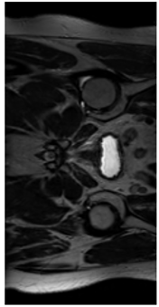         |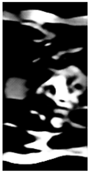     |

## Second Attempt (Complete Model Collapse)
After attempting to normalise the images by setting any zero numpy arrays representing an image in the load_data_2d method in dataset.py to zero while keeping the rest of the numpy arrays the same caused the model to collapse, with an SSIM not exceeding 0.1 and a continuously rising loss. This was because the sigmoid in the decoder was expecting a [0, 1] range, so the normalisation was modified to: 

$$ \text{inImage} = \frac{(\text{inImage} - \min)}{(\max - \min + 1\times10^{-8})} $$

**Where:**
- $\text{inImage}$ — the input image being normalized  
- $\min$ — the minimum pixel intensity value in the image (or dataset)  
- $\max$ — the maximum pixel intensity value in the image (or dataset)  
- $1 \times 10^{-8}$ — small constant added for numerical stability to prevent division by zero  
- The formula performs **Min–Max normalization**, rescaling pixel values to the range $[0, 1]$

This unfortunately still lead to a model collapse - behaving worse than the previous attempt.

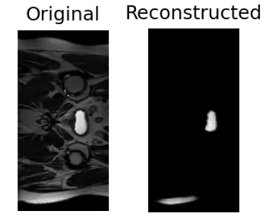

This was attributed to the use of batchNorm2d in the residual, Encoder, and Decoder blocks. BatchNorm2d behaves by normalising each channel across the batch and spatial dimensions.

$$
\hat{x}^c = \frac{x^c - \mu_c}{\sigma_c}, \quad
y^c = \gamma_c \hat{x}^c + \beta_c
$$

**Where:**
- $x^c$ — input activation for channel $c$  
- $\hat{x}^c$ — normalized activation for channel $c$  
- $\mu_c$ — mean of activations in channel $c$ (computed over the batch and spatial dimensions)  
- $\sigma_c$ — standard deviation of activations in channel $c$ (computed over the batch and spatial dimensions)  
- $\gamma_c$ — learnable scale parameter for channel $c$  
- $\beta_c$ — learnable shift (bias) parameter for channel $c$  
- $y^c$ — output activation for channel $c$ after normalization  
- The equation standardizes each channel’s activations and then applies an affine transformation ($\gamma_c$, $\beta_c$) to preserve representational flexibility

This can lead to BatchNorm2d to squish or shift the differences between channels unpredictably if there is batch variation - causing a collapse to the nearest embedding.
Why this was not visible in the prior attempt while having a good SSIM suggested that VQ loss, not the reconstruction loss was fluctuating, and could therefore be very likely attributed to specifically codeBook collapse. Which was only now visible because normalisation was semi-working

## Third Attempt (Functioning model meeting expectations, but with 0-1 loss fluctuation)

To resolve, the previous collapse, instanceNorm2d was instead used for normalisation within CNN blocks.

$$
\hat{x}_{n,c,h,w} = \frac{x_{n,c,h,w} - \mu_{n,c}}{\sqrt{\sigma_{n,c}^2 + \epsilon}}, \quad
y_{n,c,h,w} = \gamma_c \hat{x}_{n,c,h,w} + \beta_c
$$

**Where:**
- $x_{n,c,h,w}$ — input activation for sample $n$, channel $c$, at spatial position $(h, w)$  
- $\hat{x}_{n,c,h,w}$ — normalized activation  
- $\mu_{n,c}$ — mean of channel $c$ for instance $n$ (computed across spatial dimensions $h, w$)  
- $\sigma_{n,c}^2$ — variance of channel $c$ for instance $n$  
- $\epsilon$ — small constant added for numerical stability  
- $\gamma_c$ — learnable scale parameter for channel $c$  
- $\beta_c$ — learnable bias (shift) parameter for channel $c$  
- $y_{n,c,h,w}$ — final normalized and scaled output

### Training & Validation

Critically, instanceNorm2d normalises each sample individually across spacial dimenions with no shared batch statistics - minimising parameter sensitivity.
| **Original**                                         | **Reconstructed**                                       |
|------------------------------------------------------|---------------------------------------------------------|
|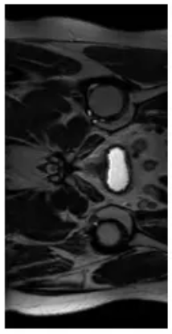   |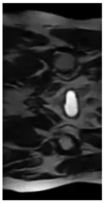|
|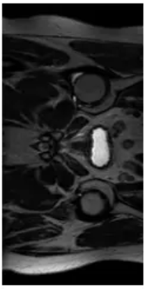  |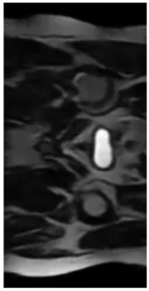|
|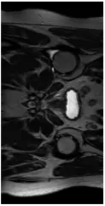  |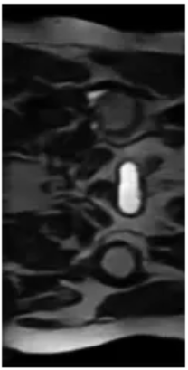|

This model showed promising reconstruction and SSIM score.

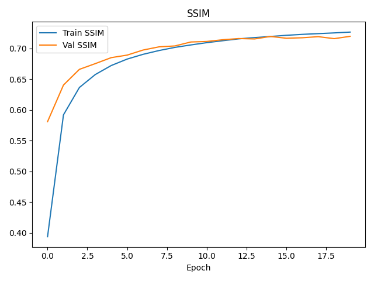

Although this fluctuation and rise in loss was unusual for the model, but the fact it stabilised and the high SSIM score that although somewhat unstable, the model was improving.

[Attempt3_loss_graph](read_me_images/loss_curve_attempt3.png)

### Testing

Although the loss behaviour was better than previous attempts, it still fluctuated between 0 and 1 before settling close to 1. Upon retraining while observing the VQ loss and reconstruction loss separately, it was the VQ loss that was causing the fluctuation. Which, after testing with different learning rates with no change, suggested that it was how the codeBook itself was behaving that caused this instability.

| **SSIM Average** | **Lowest SSIM** | **Highest SSIM** |
|-------------------|-----------------|------------------|
| 0.73              | 0.70            | 0.76             |

| **Original**                                         | **Reconstructed**                                       |
|------------------------------------------------------|---------------------------------------------------------|
|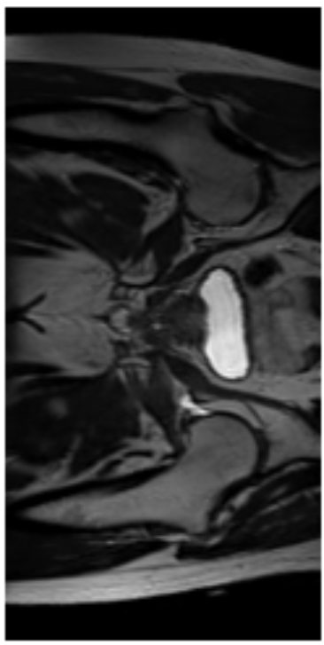|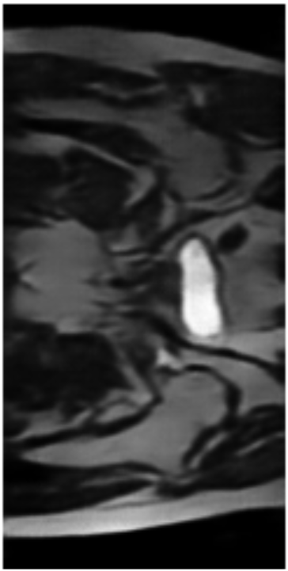|
|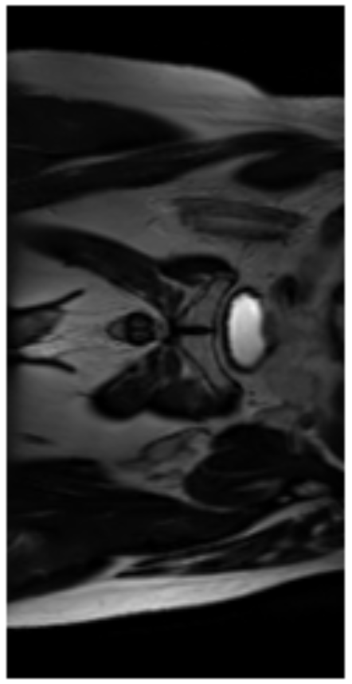|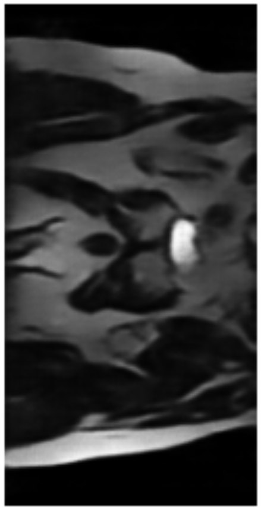|
|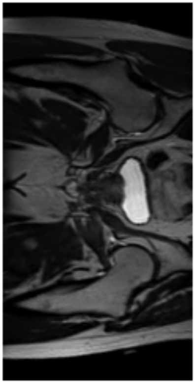|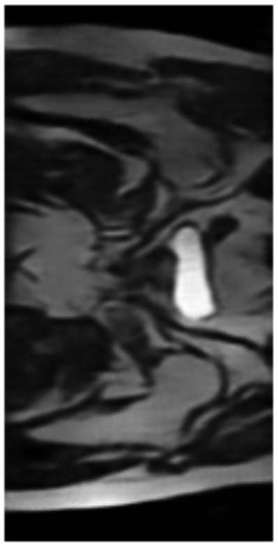|

## Fourth Attempt (Fine-tuning parameters)

### Training and Validation

With the persistent loss fluctuation, although minimal, indicated a need for finetuning. Knowing that loss was from VQ loss, not reconstruction loss from checking both separately, the embedding dimensions and number were reduced in an effort to increase the stability of the codeBook. The embedding dimensions was originally 64 and number 512, which may have caused too great a change between training steps and fewer updates per embedding per batch. 
This did successfully stabilise loss, but at ~0.24, which indicated some room for improvement.

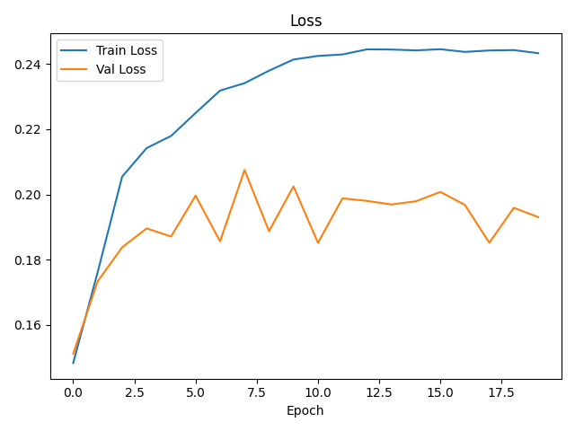

This also caused a small but signifcant reduction in SSIM, which could have been attributed to a reduced number of learned pixel mappings being considered with the reduction in embedding, creating a slightly poorer reconstruction; as oppsoed to a model that has more vectors in its latent space (codebook)

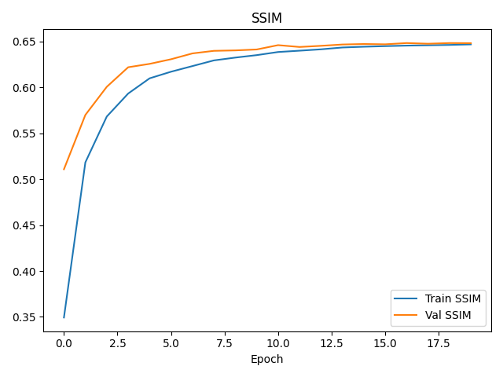

### Testing

Although a smaller SSIM, this more stable VQ-VAE still met the project criteria with even its lowest SSIM exceeding the 0.6 for the unseen test data.

 **SSIM Averarge** | **Lowest SSIM** | **Highest SSIM** |
|-------------------|-----------------|------------------|
| 0.69              | 0.66            | 0.72             |

| **Original**                                         | **Reconstructed**                                       |
|------------------------------------------------------|---------------------------------------------------------|
|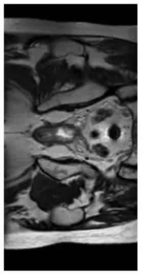|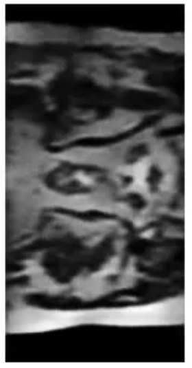|
|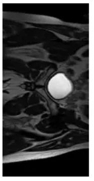|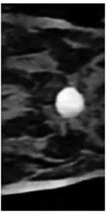|

## Dependencies
This project was run on python 3.13.9
It is recommended to not use the most recent 3.14 python version or the 3.15 pre-release while these versions are in their current stages, as they seemingly caused issues to install the prebuilt wheel/dependenies that when attempting to resolve with C++ Build Tools on Windows caused more trouble than it is worth. 

| **Package** | **Version** |
|-------------|-------------|
| colorama    | 0.4.6       |
| contourpy   | 1.3.3       |
| cycler      | 0.12.1      |
| filelock    | 3.20.0      |
| fonttools   | 4.60.1      |
| fsspec      | 2025.9.0    |
| imageio     | 2.37.0      |
| Jinja2      | 3.1.6       |
| kiwisolver  | 1.4.9       |
| lazy_loader | 0.4         |
| MarkupSafe  | 3.0.3       |
| maplotlib   | 3.10.7      |
| mpmath      | 1.3.0       |
| networkx    | 3.5         |
| nibabel     | 5.3.2       |
| numpy       | 2.3.4       |
| packaging   | 25.0        |
| pillow      | 12.0.0      |
| pyparsing   | 3.2.5       |
| python-dateutil | 2.9.0.post0 |
| scikit-image| 0.25.2      |
| scipy       | 1.16.2      |
| setuptools  | 80.9.0      |
| six         | 1.17.0      |
| sympy       | 1.14.0      |
| tifffile    | 2025.10.16  |
| torch       | 2.9.0+cu126 |
| torchvision | 0.24.0+cu126|
| tqdm        | 4.67.1      |
| typing_extensions| 4.15.0 |

## Improvements and shortcomings
Although the final two attempts did meet the SSIM requirement, the rise in loss in general was concerning and not expected of the model. At the very least it stabilised as the epochs progressed in both attempts although at a better loss in attempt 4, and it was identified across both instances that it was VQ loss. Therefore, the codebook was experiencing some instability.
This is a general consequence of having a codebook with a greater diversity of vectors for discrete latent representation, which is difficult to train, although yielding relatively high accuracy. 
Consequently, potentially investigation the perplexity of the model to determine how much of the codebook is being used, and if the increased number of embeddings are strictly necessary would be a worthwhile pursuit. Additionally, the use of the learning rate scheduler reduceLROnPlateau may be effective when the learning rate plateaus.

## Replication

1. Download HipMRI data locally (the slices, not the segmentations).

2. Open train.py and replace the pathway variables with the file locations of the train and validation nifti files you have previously downloaded. Also, include the paths of the outputs for both the test as well as training and validation parts of the project

3. Run train.py, everything needed is already in __main__.

4. The best model will be saved subsequently as "model.pth", which will be loaded in predict.py automatically. Replace the test set file location with where you have locally saved the test file of nifti files. Then replace the out directory with the file location intended for the reconstructions to be sent to

5. Run predict.py (this is the driver script)

## References

1. Sigger, N. (2020, July 23). A comprehensive guide to understanding and implementing bottleneck residual blocks. Medium. https://medium.com/@neetu.sigger/a-comprehensive-guide-to-understanding-and-implementing-bottleneck-residual-blocks-6b420706f66b

2. Azzato, A. (2020, June 12). VQ-VAE explained: Codebook and discrete latent vectors [Video]. YouTube. https://www.youtube.com/watch?v=ZNRNddl9owI

3. van den Oord, A., Vinyals, O., & Kavukcuoglu, K. (2017). Neural discrete representation learning. arXiv. https://arxiv.org/pdf/1711.00937

4. Keras Team. (n.d.). VQ-VAE example. Google Colab. https://colab.research.google.com/github/keras-team/keras-io/blob/master/examples/generative/ipynb/vq_vae.ipynb?utm_source=chatgpt.com

5. Shakes76. (2024). VectorQuantiser type signature inspiration [Code]. GitHub. https://github.com/shakes76/PatternAnalysis-2024/pull/133/files#diff-ae5323d7b76e8ae717b053d5c11b6e16ad4c1cfb3e978c0403a6c6b795078b87

6. Shakes76. (2024). Instantiating the codeBook [Code]. GitHub. https://github.com/shakes76/PatternAnalysis-2024/pull/17/files#diff-d7dbfe0b395d1329b4c1a125b291b685251e75a2d59f214d82f425faeb4eed17

7. Zalando Research. (n.d.). PyTorch VQ-VAE implementation [Notebook]. GitHub. https://github.com/zalandoresearch/pytorch-vq-vae/blob/master/vq-vae.ipynb

8. Shakes76. (2024). VQVAE model structure reference [Code]. GitHub. https://github.com/shakes76/PatternAnalysis-2024/pull/54/files#diff-d274b22575a94ddfbef2c22376203e436e2a25a44041532fc06a95aeaeabb7c7

9. Shakes76. (2024). Sorted subfolder loading with glob [Code]. GitHub. https://github.com/shakes76/PatternAnalysis-2024/pull/60/files#diff-de408f0a3e34556cba7f2669d76a94b6ae567491a845aa109b67fa4981ef479d

10. PyTorch Forum. (2020, March 18). How to load all the NIfTI files from a directory using PyTorch DataLoader [Forum post]. https://discuss.pytorch.org/t/how-to-load-all-the-nii-from-the-directory-without-augmentation-using-pytorch-dataloader/60938/4

